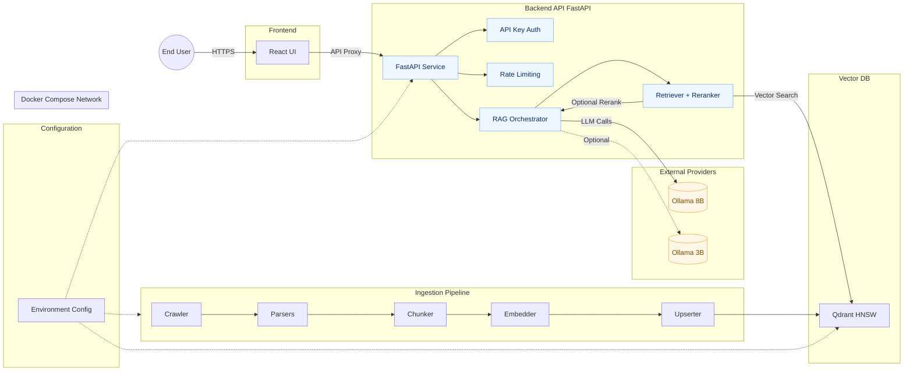

# IRS RAG Application Architecture

## Notes

- **Frontend**: Vite + React dev server proxies API calls to `http://localhost:8000`.
- **Backend**: FastAPI app exposes chat endpoints (e.g., `/v1/chat`) and health checks (`/health`).
- **Vector DB**: Qdrant stores embeddings and supports similarity search (HNSW). Data persisted under `ai/infra/qdrant` when running via Docker.
- **Ingestion**: Crawler → Parser (HTML/PDF) → Chunker → Embedder → Upserter to Qdrant. Launched via `python -m app.scripts.ingest` or the provided scripts.
- **LLM/Embeddings**: Default via OpenAI; Ollama is optional for local LLM. Selection controlled by environment variables in `.env`.
- **Runtime**: Orchestrated by `docker-compose.yml` (services: `qdrant`, `api`).
