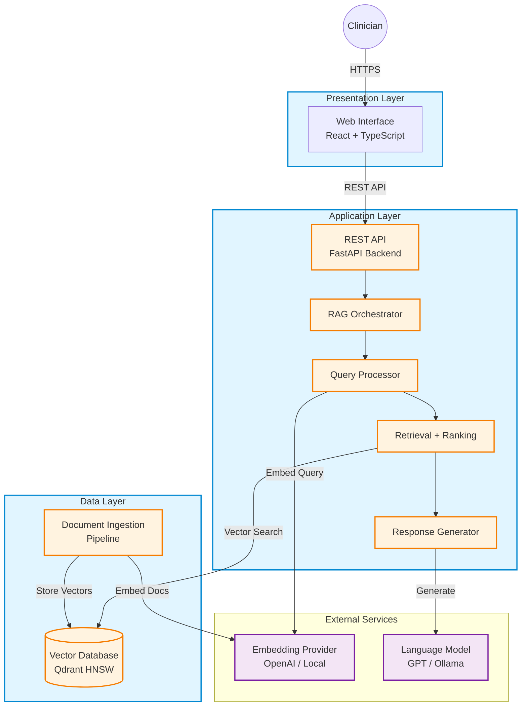

# An End-to-End AI Clinical Decision Support System Using Retrieval-Augmented Generation

**Authors:** [To be completed]  
**Affiliation:** [To be completed]  
**Conference:** Springer Lecture Notes in Networks and Systems (LNNS) / Communications in Computer and Information Science (CCIS)

---

## Abstract

Healthcare institutions increasingly require intelligent systems that assist clinicians in making evidence-based decisions at the point of care. While Large Language Models demonstrate remarkable natural language capabilities, their propensity for generating unsupported information limits direct clinical deployment. This paper presents the architecture and exploratory evaluation of a modular Clinical Decision Support System that employs Retrieval-Augmented Generation to ground model outputs in verifiable medical guidelines. The implemented system integrates a web-based user interface, a microservices backend orchestrating the retrieval pipeline, and a vector database for semantic knowledge retrieval. Key architectural components include specialized medical document ingestion, context-aware query processing, and response generation with explicit source attribution. Initial feasibility testing demonstrates that the system retrieves contextually relevant information and generates responses grounded in authoritative sources. This work contributes a practical reference architecture for healthcare institutions exploring the integration of language model capabilities with existing clinical workflows while maintaining transparency and verifiability.

## Keywords

Clinical Decision Support · Retrieval-Augmented Generation · Healthcare AI · Medical Information Systems · Vector Databases

---

## 1. Introduction

### 1.1 Background and Motivation

Clinical Decision Support Systems have undergone substantial evolution, transitioning from rigid rule-based engines to adaptive platforms capable of processing complex clinical scenarios [1]. Recent advances in Large Language Models present opportunities for enhancing clinical information retrieval and synthesis through natural language understanding capabilities [2]. However, the direct application of these models in healthcare contexts faces fundamental challenges related to accuracy, transparency, and knowledge currency.

The phenomenon of model-generated content that appears plausible but lacks factual grounding—commonly termed "hallucination"—poses significant risks in clinical settings where information accuracy directly impacts patient safety [3]. Additionally, the static nature of model parameters means that medical knowledge embedded during training may not reflect current clinical guidelines or emerging research findings [4].

### 1.2 Retrieval-Augmented Generation Paradigm

Retrieval-Augmented Generation represents a architectural pattern wherein language models are augmented with external knowledge retrieval capabilities [5]. Rather than relying solely on parametric knowledge encoded during training, RAG systems dynamically retrieve relevant information from external repositories before generating responses. This approach enables access to current information, provides transparency through source attribution, and reduces the likelihood of generating unsupported claims.

### 1.3 Research Gap and Contribution

While recent surveys document the theoretical advantages of RAG in healthcare applications [6, 7], existing literature predominantly focuses on algorithmic enhancements or task-specific prototype implementations. A notable gap exists regarding comprehensive architectural blueprints suitable for institutional deployment, particularly those addressing practical considerations such as integration patterns, scalability characteristics, and operational requirements.

This paper contributes a complete reference architecture for a RAG-based Clinical Decision Support System, detailing the integration of presentation, application, and data layers. We describe the implementation of domain-specific components including medical document processing, conversational context management, and adaptive response policies. The architecture emphasizes modularity, enabling institutions to adapt components based on deployment constraints and regulatory requirements.

### 1.4 Paper Organization

Section 2 reviews related work in medical language models and retrieval-augmented systems. Section 3 presents the system architecture and component design. Section 4 describes the implementation methodology. Section 5 presents exploratory evaluation results. Section 6 discusses limitations and ethical considerations. Section 7 concludes and outlines future directions.

---

## 2. Related Work

### 2.1 Language Models in Healthcare

The application of pre-trained language models in medical domains has gained substantial attention following the success of general-purpose architectures [8]. Domain-adapted models such as BioBERT and ClinicalBERT demonstrate improved performance on medical entity recognition and relation extraction tasks through continued training on biomedical corpora [9, 10].

More recently, large-scale models including Med-PaLM have shown promising capabilities in clinical knowledge tasks [11]. However, evaluations revealed limitations including potential for harm through inaccurate information generation, highlighting the necessity for additional safeguards and grounding mechanisms in clinical deployments.

### 2.2 Retrieval-Augmented Systems

The retrieval-augmented paradigm evolved from early approaches combining neural retrievers with generative models through joint training [5]. Contemporary implementations typically employ modular architectures where retrieval and generation components operate independently, facilitating flexible provider selection and staged optimization [12].

Recent taxonomies categorize RAG approaches into naive implementations (simple retrieval followed by generation), advanced techniques (incorporating query enhancement and result reranking), and modular systems (specialized components for different pipeline stages) [13]. These taxonomies provide frameworks for understanding design trade-offs in specific application contexts.

### 2.3 Clinical RAG Applications

Several research efforts have explored RAG applications in specific medical tasks. Systems focusing on clinical question answering demonstrate the utility of incorporating structured knowledge graphs alongside unstructured text retrieval [14]. Biomedical literature synthesis systems illustrate techniques for aggregating information across multiple documents [15].

However, these implementations generally target specific tasks rather than providing general-purpose decision support capabilities. Furthermore, architectural documentation often lacks detail regarding deployment considerations, integration patterns, and system-level performance characteristics.

### 2.4 Identified Research Gap

The literature demonstrates growing interest in RAG applications for healthcare but reveals limited availability of comprehensive architectural documentation suitable for institutional deployment. This work addresses this gap by presenting a complete, modular architecture with explicit integration patterns and practical deployment considerations.

---

## 3. System Architecture

### 3.1 Architectural Overview

The proposed system follows a three-tier microservices pattern, enabling independent development, testing, and scaling of components. The architecture comprises:

1. **Presentation Layer**: Web-based interface for clinician interaction
2. **Application Layer**: Backend services orchestrating the RAG pipeline
3. **Data Layer**: Vector database enabling semantic knowledge retrieval

Communication between tiers occurs through well-defined APIs using standard protocols, facilitating integration with existing institutional systems.

> **Note**: This diagram will be replaced with a high-resolution figure in the final submission.

### 3.2 Presentation Layer

The web-based interface provides clinicians with natural language query capabilities through a conversational interface. Key features include:

- **Conversational Interaction**: Chat-based interface with conversation history management
- **Patient Context Upload**: Support for patient document uploads with optical character recognition
- **Source Display**: Presentation of retrieved sources with citations for verification
- **Accessibility**: Responsive design supporting various device form factors

The interface maintains conversation state client-side and communicates with the backend through REST APIs, enabling stateless backend services that scale horizontally.

### 3.3 Application Layer

The backend application layer is implemented using a modern web framework providing automatic request validation, asynchronous processing, and self-documenting APIs. Core services include:

**Chat Service**: Processes clinical queries with conversation history context  
**Patient Service**: Handles patient document processing and context extraction  
**Administration Service**: Provides system monitoring and knowledge base management

The RAG pipeline orchestrates retrieval and generation through sequential stages:

1. **Query Reception**: Accepts queries with optional conversation history
2. **Query Enhancement**: Resolves conversational references to create standalone queries
3. **Embedding Generation**: Converts queries to dense vector representations
4. **Semantic Retrieval**: Performs similarity search against the knowledge base
5. **Optional Reranking**: Applies cross-encoder models for relevance refinement
6. **Context Assembly**: Constructs generation prompts with retrieved content
7. **Response Generation**: Produces answers using language models with controlled parameters
8. **Post-Processing**: Adds source citations and confidence indicators

**Query Enhancement**: To support multi-turn conversations, the system employs query rewriting when conversational references are detected. An auxiliary language model reformulates queries containing pronouns or implicit context into self-contained forms suitable for accurate retrieval.

**Adaptive Policies**: The system classifies queries by complexity and applies corresponding response policies. Straightforward queries receive concise responses, while complex clinical scenarios trigger more comprehensive retrieval and elaboration.

### 3.4 Data Layer

**Vector Database**: The system employs an open-source vector database utilizing Hierarchical Navigable Small World graph indexing for efficient approximate nearest neighbor search. This enables responsive retrieval even as the knowledge base scales.

Document chunks are stored with comprehensive metadata including:
- Source identifiers and document titles
- Structural information (section headings, page numbers)
- Content type indicators
- Temporal versioning information

**Ingestion Pipeline**: Medical documents undergo structured processing:

1. **Acquisition**: Web crawling with rate limiting and robots.txt compliance
2. **Parsing**: Format-specific extractors for HTML and PDF content
3. **Normalization**: Text cleaning while preserving medical terminology
4. **Chunking**: Section-aware segmentation respecting document structure
5. **Embedding**: Vector generation using dense embedding models
6. **Indexing**: Storage in vector database with metadata preservation

The chunking strategy prioritizes semantic coherence by detecting structural boundaries (headings, numbered sections) and creating segments that preserve contextual information.

### 3.5 External Service Integration

The architecture supports multiple providers for embeddings and generation, enabling institutions to select services based on cost constraints, data governance requirements, and performance characteristics:

- **Embedding Providers**: Cloud-based services or local transformer models
- **Generation Providers**: Proprietary large language models or locally-hosted alternatives

This multi-provider approach facilitates deployment flexibility while maintaining consistent system interfaces.

---

## 4. Methodology

### 4.1 Knowledge Base Construction

The knowledge base incorporates content from authoritative medical sources including clinical guidelines and institutional protocols. The ingestion process emphasizes:

- **Source Verification**: Limiting ingestion to recognized authoritative sources
- **Structural Preservation**: Maintaining document organization through metadata
- **Version Tracking**: Enabling knowledge base updates while preserving historical versions

### 4.2 Retrieval Configuration

Semantic retrieval employs configurable parameters balancing recall and precision:

- **Initial Retrieval**: Broad candidate set retrieval using cosine similarity
- **Similarity Filtering**: Threshold-based exclusion of low-relevance results
- **Optional Reranking**: Fine-grained relevance assessment for top candidates
- **Final Selection**: Subset selection for context assembly

Similarity thresholds are calibrated to balance comprehensive retrieval against context quality, with overly dissimilar results excluded to prevent context pollution.

### 4.3 Generation Configuration

Response generation employs structured prompts establishing system role, providing retrieved context with attribution, incorporating patient-specific information when available, and setting explicit constraints on citation requirements and factual grounding.

The system uses deterministic generation parameters (temperature near zero) to promote consistent, factual responses rather than creative elaboration.

### 4.4 Safety Mechanisms

Multiple safeguards are implemented:

- **Retrieval Quality Gates**: Low-similarity retrievals trigger explicit uncertainty acknowledgment
- **Mandatory Attribution**: All responses include source citations
- **Confidence Indicators**: Retrieval quality metrics inform confidence assessments
- **Disclaimer Injection**: Automatic addition of appropriate clinical disclaimers
- **Privacy Protection**: Logging systems exclude personally identifiable information

### 4.5 Patient Context Handling

Patient-specific documents are processed through optical character recognition or direct text extraction, maintained separately from the general knowledge base, and incorporated into generation prompts while prioritizing guideline content for medical reasoning.

This separation ensures patient data isolation while enabling personalized clinical context when relevant.

---

## 5. Experimental Setup and Evaluation

### 5.1 Deployment Configuration

An exploratory evaluation was conducted using containerized deployment with the following components:

- Backend API service on Python runtime
- Vector database with HNSW indexing
- Web interface served via development server
- Cloud-based embedding service (1536-dimensional vectors)
- Cloud-based language model for generation

### 5.2 Knowledge Base

The evaluation knowledge base contained medical guidelines and reference documents, resulting in several thousand indexed chunks after processing. Content included clinical practice guidelines, medical reference materials, and procedural documentation.

### 5.3 Test Queries

A diverse set of clinical queries was constructed spanning:

- Diagnostic criteria inquiries
- Treatment approach questions
- Pharmacological information requests
- Pathophysiology explanations

### 5.4 Evaluation Approach

The evaluation focused on system-level feasibility rather than quantitative performance metrics:

**Retrieval Assessment**:
- Qualitative review of retrieval relevance
- Examination of source diversity
- Analysis of structural metadata preservation

**Generation Assessment**:
- Manual evaluation of response appropriateness
- Verification of source citation presence
- Review of factual grounding

**System Characteristics**:
- Observation of response latency patterns
- Assessment of error handling
- Review of scalability characteristics

### 5.5 Results

**Retrieval Observations**:

The semantic retrieval system generally identified content relevant to submitted queries. The similarity-based filtering mechanism successfully excluded highly dissimilar content. Metadata preservation enabled precise source attribution including section-level citations.

Queries aligned with knowledge base content produced relevant retrievals, while queries outside the indexed domain triggered appropriate low-confidence indicators.

**Generation Observations**:

Generated responses typically addressed the clinical questions posed and incorporated information from retrieved context. Source citations consistently appeared in responses, enabling verification. 

Query enhancement for conversational context produced improved retrieval for multi-turn interactions compared to using raw follow-up queries.

**System Characteristics**:

The system demonstrated responsive behavior suitable for interactive use. The modular architecture enabled independent component testing and troubleshooting. Provider switching (between embedding and generation services) functioned as designed.

**Qualitative Notes**:

Response quality correlated with knowledge base coverage—well-represented topics produced more comprehensive answers. Some responses exhibited verbosity that could benefit from conciseness optimization. The confidence scoring mechanism generally aligned with subjective response quality assessment.

### 5.6 Discussion

The exploratory evaluation demonstrates the feasibility of the proposed architecture for clinical decision support applications. The system successfully integrates presentation, application, and data layers to provide retrieval-augmented response generation.

The modular design facilitated component-level development and testing, supporting iterative refinement. The multi-provider support enabled exploration of cost-performance trade-offs across different embedding and generation services.

Limitations of this evaluation include the constrained knowledge base size relative to production requirements, use of constructed rather than authentic clinical queries, and qualitative rather than quantitative assessment methodology. These limitations suggest directions for future validation efforts.

---

## 6. Limitations and Ethical Considerations

### 6.1 Technical Limitations

**Knowledge Scope**: System effectiveness depends directly on knowledge base coverage. Content gaps result in incomplete or unavailable information for specific queries. While the system provides explicit fallback responses, users must understand coverage boundaries.

**Retrieval Challenges**: Semantic similarity search may encounter difficulties with highly specialized terminology, rare clinical presentations, or queries requiring synthesis across multiple disparate sources. The threshold-based filtering mechanism, while beneficial for precision, may exclude relevant information in edge cases.

**Context Constraints**: Language model context window limitations restrict the volume of retrieved information that can be incorporated into generation prompts. Complex queries requiring extensive supporting information may necessitate prioritization that omits potentially relevant content.

**Latency Variability**: While the system demonstrates responsive behavior under typical conditions, network conditions, database load, and external API response times introduce variability. Time-critical clinical scenarios may require latency guarantees beyond current capabilities.

### 6.2 Clinical and Ethical Considerations

**Decision Support, Not Clinical Decision-Making**

This system provides information retrieval and synthesis capabilities to **assist** clinicians—it does not provide medical advice, diagnosis, or treatment recommendations. All system outputs require verification and interpretation by qualified healthcare professionals. The system explicitly disclaims clinical decision-making authority.

**Data Privacy and Governance**

The system processes clinical queries and patient-specific documents that may contain protected health information. Deployment requires:
- Compliance with applicable healthcare data protection regulations
- Implementation of appropriate access controls and encryption
- Audit logging for accountability
- Data retention policies aligned with regulatory requirements

The architecture's support for local deployment enables institutions to maintain data within their security perimeters.

**Transparency Limitations**

While the system provides source citations to enhance transparency, the internal reasoning process of neural language models remains opaque. Clinicians should understand that responses represent pattern-based generation informed by retrieved context rather than explicit logical deduction.

**Bias Considerations**

Medical knowledge bases may reflect biases present in source materials, potentially affecting information retrieval and response generation across different patient populations or clinical conditions. The current system does not implement explicit bias detection or mitigation mechanisms.

**Accountability Structures**

Healthcare institutions deploying AI-assisted systems must establish clear accountability frameworks defining responsibility for system outputs, error handling procedures, and incident reporting mechanisms. The system's audit logging supports accountability but does not replace institutional governance structures.

### 6.3 Pre-Deployment Requirements

Before clinical deployment, institutions should:

1. Conduct clinical validation studies assessing decision support utility
2. Obtain appropriate regulatory clearances based on jurisdictional requirements
3. Implement comprehensive integration testing with existing systems
4. Provide thorough user training on capabilities and limitations
5. Establish monitoring and evaluation procedures for ongoing quality assessment

---

## 7. Conclusion and Future Work

This paper presented the architecture and exploratory evaluation of a Retrieval-Augmented Generation-based Clinical Decision Support System. The modular three-tier architecture integrates web-based presentation, microservices backend orchestration, and vector database retrieval to provide clinicians with evidence-based information access.

Key contributions include:

1. A comprehensive architectural blueprint suitable for institutional adaptation
2. Detailed component design for medical document processing and conversational interaction
3. Implementation patterns for multi-provider support enabling deployment flexibility
4. Exploratory evaluation demonstrating system feasibility

The work bridges the gap between algorithmic research on retrieval-augmented generation and practical healthcare system deployment, providing institutions with a reference architecture for exploring language model integration into clinical workflows.

### Future Directions

Several avenues warrant further investigation:

**Enhanced Retrieval**: Exploration of multi-hop reasoning capabilities for complex queries requiring information synthesis across multiple sources. Investigation of temporal reasoning to prioritize current guidelines over outdated content. Fine-tuning of embedding models on medical corpora to improve domain-specific retrieval accuracy.

**Improved Generation**: Development of post-generation fact verification mechanisms to detect and mitigate unsupported claims. Implementation of adaptive response length control to balance comprehensiveness with conciseness. Extension to multi-modal capabilities incorporating medical imaging analysis.

**Rigorous Validation**: Clinical studies assessing system impact on decision-making processes and workflow efficiency. Development of standardized evaluation frameworks for clinical RAG systems. Longitudinal studies examining system performance as knowledge bases evolve.

**Ethical Enhancement**: Implementation of bias detection and mitigation strategies. Enhanced explainability features providing clearer reasoning traces. Systematic adversarial testing to identify failure modes and edge cases.

**Integration Advancement**: Direct integration with Electronic Health Record systems for seamless workflow incorporation. Support for federated knowledge bases enabling multi-institutional collaboration. Real-time knowledge base update mechanisms aligned with guideline publication cycles.

The evolution toward safe, effective clinical decision support systems requires continued collaboration among AI researchers, healthcare professionals, and institutional stakeholders. This work contributes one component toward that objective, demonstrating architectural patterns that balance capability with transparency, flexibility with standardization, and innovation with safety.

---

## References

[1] Sutton, R.T., Pincock, D., Baumgart, D.C., et al.: An overview of clinical decision support systems: benefits, risks, and strategies for success. npj Digital Medicine **3**(17), 1–10 (2020)

[2] Rajkomar, A., Dean, J., Kohane, I.: Machine learning in medicine. New England Journal of Medicine **380**(14), 1347–1358 (2019)

[3] Ji, Z., Lee, N., Frieske, R., et al.: Survey of hallucination in natural language generation. ACM Computing Surveys **55**(12), Article 248 (2023)

[4] Singhal, K., Azizi, S., Tu, T., et al.: Large language models encode clinical knowledge. Nature **620**(7972), 172–180 (2023)

[5] Lewis, P., Perez, E., Piktus, A., et al.: Retrieval-augmented generation for knowledge-intensive NLP tasks. In: Advances in Neural Information Processing Systems, vol. 33, pp. 9459–9474 (2020)

[6] Gao, Y., Xiong, Y., Gao, X., et al.: Retrieval-augmented generation for large language models: A survey. arXiv preprint arXiv:2312.10997 (2023)

[7] Amugongo, L.M., Kriebel, S., Lütge, C.: Retrieval augmented generation and representative vector summarization for large unstructured textual data in medical education. arXiv preprint arXiv:2308.00479 (2023)

[8] Brown, T.B., Mann, B., Ryder, N., et al.: Language models are few-shot learners. In: Advances in Neural Information Processing Systems, vol. 33, pp. 1877–1901 (2020)

[9] Lee, J., Yoon, W., Kim, S., et al.: BioBERT: a pre-trained biomedical language representation model for biomedical text mining. Bioinformatics **36**(4), 1234–1240 (2020)

[10] Alsentzer, E., Murphy, J.R., Boag, W., et al.: Publicly available clinical BERT embeddings. In: Proceedings of the 2nd Clinical Natural Language Processing Workshop, pp. 72–78 (2019)

[11] Singhal, K., Tu, T., Gottweis, J., et al.: Towards expert-level medical question answering with large language models. arXiv preprint arXiv:2305.09617 (2023)

[12] Ram, O., Levine, Y., Dalmedigos, I., et al.: In-context retrieval-augmented language models. Transactions of the Association for Computational Linguistics **11**, 1316–1331 (2023)

[13] Gao, Y., Xiong, Y., Gao, X., et al.: Retrieval-augmented generation for large language models: A survey. arXiv preprint arXiv:2312.10997 (2023)

[14] Jin, Q., Yang, Y., Chen, Q., Lu, Z.: GeneGPT: Augmenting large language models with domain tools for improved access to biomedical information. Bioinformatics **40**(2), btae075 (2024)

[15] Xiong, G., Jin, Q., Lu, Z., Zhang, A.: Benchmarking retrieval-augmented generation for medicine. arXiv preprint arXiv:2402.13178 (2024)
