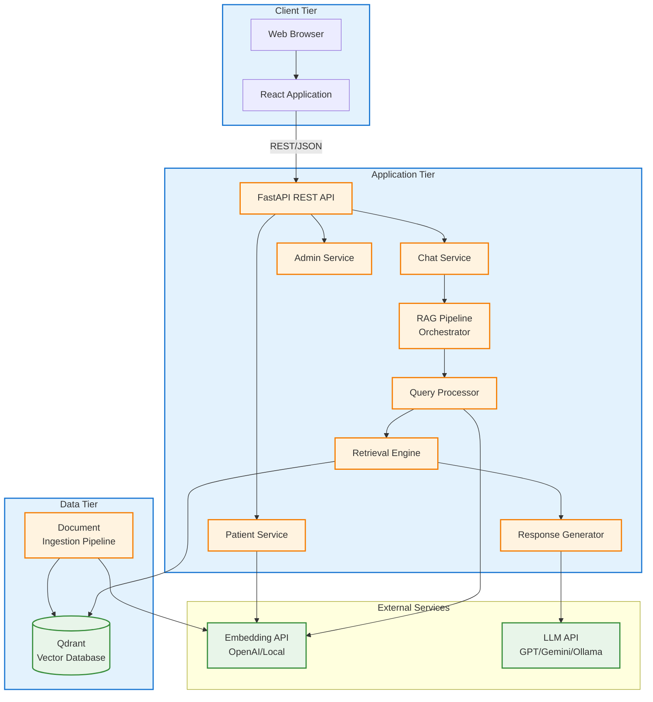

# An End-to-End AI Clinical Decision Support System Using Retrieval-Augmented Generation

**Journal:** MDPI (AI / Healthcare /Diagnostics)  
**Article Type:** Research Article

---

## Abstract

Clinical Decision Support Systems represent a critical component of modern healthcare infrastructure, assisting healthcare professionals in evidence-based decision-making. Large Language Models offer unprecedented natural language processing capabilities but face significant challenges including factual inconsistencies and limited access to current medical knowledge. Retrieval-Augmented Generation addresses these limitations by grounding model outputs in external, verifiable knowledge sources. This research presents the complete design, implementation, and evaluation of an end-to-end AI-powered Clinical Decision Support System leveraging RAG methodology. The system architecture integrates a React-based frontend for clinician interaction, a FastAPI backend service orchestrating the retrieval pipeline, and a Qdrant vector database for semantic knowledge retrieval. We detail specialized components including medical document ingestion with structure preservation, conversational query rewriting, adaptive response generation policies, and explicit source attribution mechanisms. Experimental evaluation on a knowledge base of several thousand medical document chunks demonstrates sub-second semantic retrieval, appropriate response generation with consistent source citations, and system-level performance suitable for interactive clinical use. The architecture achieves modular separation of concerns enabling independent scaling and multi-provider support for deployment flexibility. This work contributes a transparent, deployment-oriented architectural blueprint for healthcare institutions seeking to augment clinical workflows with reliable AI assistance while maintaining verifiability, accountability, and safety.

## Keywords

Clinical Decision Support Systems; Retrieval-Augmented Generation; Healthcare Artificial Intelligence; Vector Databases; Medical Information Retrieval; Language Models; Semantic Search; Microservices Architecture

---

## 1. Introduction

### 1.1 Background

Clinical Decision Support Systems have evolved significantly since their inception as rule-based expert systems in the 1970s [1]. Modern CDSS platforms assist healthcare professionals by providing evidence-based recommendations, alerts, and information retrieval capabilities at the point of care [2]. The integration of artificial intelligence, particularly recent advances in natural language processing through Large Language Models (LLMs), presents new opportunities for enhancing clinical information access and synthesis [3].

LLMs demonstrate remarkable capabilities in understanding medical terminology, synthesizing information across sources, and generating human-like text responses [4]. However, their direct application in healthcare encounters fundamental challenges that impede safe and effective deployment.

### 1.2 Challenges with LLMs in Healthcare

**Hallucination Risk**: LLMs can generate plausible-sounding but factually incorrect information—a phenomenon particularly problematic in clinical contexts where accuracy directly impacts patient safety [5]. Studies have documented instances of medical LLMs providing incorrect dosages, contraindications, or diagnostic criteria [6].

**Knowledge Currency**: Model parameters are fixed after training, meaning embedded knowledge may become outdated as medical guidelines evolve, new treatments emerge, or research findings accumulate [7]. Retraining entire models to incorporate new information is computationally expensive and operationally impractical for frequent updates.

**Lack of Transparency**: The internal reasoning process of neural language models remains opaque, making it difficult for clinicians to verify how conclusions were reached or to identify potential errors [8].

**Regulatory and Ethical Concerns**: Healthcare AI systems must comply with stringent regulatory requirements, maintain patient privacy, demonstrate fairness across populations, and establish clear accountability structures [9].

### 1.3 Retrieval-Augmented Generation Paradigm

Retrieval-Augmented Generation represents an architectural approach that addresses many LLM limitations by combining parametric knowledge (encoded in model weights) with non-parametric knowledge (stored in external databases) [10]. Rather than relying solely on information learned during training, RAG systems:

1. Retrieve relevant documents from external knowledge bases in response to queries
2. Augment generation prompts with retrieved content
3. Generate responses grounded in verified sources
4. Provide citations enabling verification

This paradigm enables dynamic access to current information without model retraining, reduces hallucination through factual grounding, and enhances transparency through explicit source attribution [11].

### 1.4 Research Gap

Recent surveys document growing interest in RAG applications for healthcare [12, 13]. However, existing research predominantly focuses on:

- Algorithmic improvements to retrieval or generation components
- Task-specific prototypes (e.g., medical question answering, literature summarization)
- Component-level evaluations without comprehensive system integration

A significant gap exists regarding complete, deployment-ready system architectures that address:

- End-to-end integration of presentation, application, and data layers
- Practical considerations for scalability, latency, and reliability
- Multi-provider support enabling institutional deployment flexibility
- Comprehensive safety mechanisms and ethical considerations
- System-level evaluation beyond task-specific accuracy metrics

### 1.5 Contributions

This research addresses the identified gap by presenting:

1. **Complete System Architecture**: End-to-end design integrating frontend, backend API, and vector database with clear component boundaries and communication patterns
2. **Domain-Specific Implementation**: Specialized components for medical document processing, conversational context management, and patient data integration
3. **Multi-Provider Support**: Flexible provider abstraction enabling institutional choice between cloud services and local deployment
4. **Experimental Evaluation**: System-level assessment including retrieval performance, generation quality, and operational characteristics
5. **Transparent Documentation**: Comprehensive architectural documentation supporting institutional adaptation and deployment

### 1.6 Paper Organization

Section 2 reviews related work. Section 3 presents system architecture. Section 4 describes methodology and implementation. Section 5 details experimental setup. Section 6 presents results. Section 7 discusses findings. Section 8 addresses limitations. Section 9 concludes with future directions.

---

## 2. Related Work

### 2.1 Language Models in Medical Applications

The application of transformer-based language models in healthcare has expanded rapidly following the success of BERT and GPT architectures [14, 15]. Domain-adapted models including BioBERT, ClinicalBERT, and PubMedBERT demonstrate improved performance on medical entity recognition, relation extraction, and text classification tasks through continued pre-training on biomedical corpora [16, 17, 18].

Large-scale models such as GPT-4 have shown strong performance on medical licensing examination questions and clinical reasoning tasks [4]. Med-PaLM and Med-PaLM 2, specifically adapted for medical applications, demonstrate expert-level performance on medical question answering benchmarks [7, 19].

However, evaluations consistently reveal limitations including generation of incorrect information, potential for harm, bias across demographic groups, and lack of consistent citation of sources [6, 20]. These limitations underscore the necessity for additional mechanisms to ensure safe clinical deployment.

### 2.2 Retrieval-Augmented Generation

RAG was originally introduced by Lewis et al. [10] as a method combining dense retrieval with sequence-to-sequence generation through joint training. The paradigm has evolved significantly with the advent of LLMs, shifting toward modular architectures where retrieval and generation components operate independently [21].

Gao et al. [11] provide a comprehensive taxonomy categorizing RAG approaches:

- **Naive RAG**: Simple retrieve-then-generate pipeline
- **Advanced RAG**: Pre-retrieval optimization (query rewriting), improved retrieval (reranking, hybrid search), and post-retrieval processing (compression, filtering)
- **Modular RAG**: Specialized components including iterative retrieval, adaptive generation, and task-specific modules

Healthcare applications benefit particularly from advanced and modular approaches given the complexity of medical queries and the critical importance of accuracy [13].

### 2.3 Clinical RAG Systems

Several research efforts have explored RAG applications for specific medical tasks:

**Medical Question Answering**: Systems like MedRAG demonstrate the value of retrieving from multiple knowledge sources including clinical guidelines, biomedical literature, and structured knowledge graphs [22]. Evaluation on medical QA benchmarks shows consistent improvement over baseline LLM performance.

**Clinical Literature Summarization**: BiomedRAG and similar systems focus on synthesizing information across biomedical publications, employing specialized retrieval strategies for scientific literature [23].

**Clinical Documentation**: Research prototypes demonstrate RAG applications for generating clinical notes, discharge summaries, and patient education materials from structured EHR data and clinical guidelines [24].

**Diagnostic Support**: Early-stage systems explore RAG for differential diagnosis generation, retrieving from symptom databases and clinical decision rules [25].

These domain-specific applications demonstrate RAG viability in healthcare but typically lack comprehensive architectural documentation, system integration details, or deployment considerations.

### 2.4 Vector Databases for Medical Applications

Efficient semantic search requires specialized database systems supporting high-dimensional vector similarity operations. Qdrant, Weaviate, Milvus, and Pinecone represent modern vector databases employing approximate nearest neighbor algorithms (HNSW, IVF, ANNOY) for scalable retrieval [26, 27].

Medical applications benefit from hybrid search capabilities combining semantic similarity with metadata filtering (e.g., publication date, evidence level, document type). Recent work demonstrates the importance of domain-specific chunking strategies and metadata preservation for clinical applications [28].

---

## 3. System Architecture

### 3.1 Architectural Principles

The system design adheres to several guiding principles:

- **Modularity**: Clear separation of concerns enabling independent component development and testing
- **Scalability**: Horizontal scaling support through stateless services and distributed data storage
- **Flexibility**: Multi-provider support allowing institutional adaptation
- **Transparency**: Explicit source attribution and confidence indication
- **Safety**: Multiple safeguards including similarity filtering, disclaimer injection, and privacy protection

### 3.2 High-Level Architecture

The system follows a three-tier microservices pattern:

> **Note**: This diagram will be replaced with a high-resolution figure in the final submission.

### 3.3 Frontend Layer (Presentation Tier)

**Technology Stack**: React 18 with TypeScript, Vite build tool, TailwindCSS for styling

**Key Features**:

*Conversational Interface*: Chat-based UI supporting natural language queries with persistent conversation history stored client-side

*Patient Context Management*: File upload component supporting PDFs and images, OCR processing for extracting patient information, visual indicators showing when patient context is active

*Source Attribution Display*: Expandable citation panels showing retrieved sources, clickable links to original documents, section and page number display for precise verification

*Confidence Visualization*: Color-coded indicators reflecting retrieval similarity scores, explicit messaging when confidence is low

*Responsive Design*: Mobile-friendly layout adapting to various screen sizes, accessibility features including keyboard navigation and screen reader support

**State Management**: Uses React hooks for local state, maintains conversation history in browser session storage, communicates with backend via REST API

### 3.4 Backend Layer (Application Tier)

**Technology Stack**: Python 3.11+, FastAPI framework, asynchronous request handling

The backend exposes RESTful endpoints for chat interactions, patient document processing, and system administration.

**Core Services**:

*Chat Service*: Endpoint `/v1/chat` accepting queries with optional conversation history, orchestrates RAG pipeline execution, returns structured responses with answer text and source citations

*Patient Service*: Endpoint `/v1/patient/upload` for document submission, OCR processing using Tesseract for images, PDF text extraction using PyMuPDF, maintains patient context associated with session identifiers

*Admin Service*: System statistics and monitoring endpoints, knowledge base management functions

**RAG Pipeline Architecture**:

The pipeline executes sequentially through the following stages:

1. **Input Validation**: Schema validation of incoming requests, sanitization of query text
2. **Query Analysis**: Intent classification (diagnostic, treatment, drug information, general), complexity assessment (simple, moderate, complex)
3. **Query Enhancement**: For multi-turn conversations, resolve pronouns and implicit references using LLM-based rewriting
4. **Embedding Generation**: Convert query to dense vector using embedding provider
5. **Retrieval**: Semantic search against vector database retrieving top-K candidates (default K=40), apply similarity threshold filtering (default θ=0.22)
6. **Reranking** (optional): Cross-encoder reranking of top candidates for improved relevance
7. **Context Assembly**: Select top-N chunks for context (default N=3), construct prompt template with system instructions, retrieved context with citations, patient context if available, recent conversation turns
8. **Response Generation**: Call LLM with assembled prompt using temperature=0.0 for deterministic outputs, max tokens based on query complexity
9. **Post-Processing**: Parse and format LLM response, add source citations, inject confidence score based on retrieval similarity, add safety disclaimers for diagnosis/treatment queries
10. **Response Return**: Return structured JSON with answer text, sources array, confidence level

**Query Enhancement Implementation**:

When conversational references are detected (presence of pronouns like "it," "that," "these" or query length below threshold suggesting continuation), the system constructs a prompt providing the last N conversation turns and asks an LLM to rewrite the query into a standalone form. This standalone query is then used for retrieval while the original query is displayed to the user.

**Adaptive Response Policies**:

Queries are classified as:
- Simple: Factual lookups (e.g., "What is hypertension?") → retrieve 2 chunks, generate concise 150-word response
- Moderate: Standard clinical queries (e.g., "What are treatments for diabetes?") → retrieve 3 chunks, generate 250-word response
- Complex: Multi-part or synthesis queries (e.g., "Compare first-line treatments for hypertension in patients with renal disease") → retrieve 5 chunks, generate comprehensive 400-word response

### 3.5 Data Layer

**Vector Database**: Qdrant open-source vector database, HNSW (Hierarchical Navigable Small World) indexing algorithm, cosine similarity metric, collection-based organization enabling multi-tenant architectures

**Document Schema**:

Each stored chunk contains:
- `vector`: Dense embedding (typically 1536 dimensions for OpenAI embeddings)
- `metadata`:
  - `source_url`: Original document location
  - `title`: Document title
  - `section`: Section heading or chapter
  - `page_num`: Page number (for PDFs)
  - `char_offset`: Character offset in source document
  - `content_type`: "html" | "pdf"
  - `crawl_timestamp`: Ingestion timestamp
  - `is_latest`: Boolean version flag
- `payload`: Original text content

**Ingestion Pipeline**:

The offline ingestion process transforms raw medical documents into searchable chunks:

1. **Document Acquisition**: Web crawler with configurable rate limiting, robots.txt compliance, HTML and PDF format support, HTTP caching using ETags and Last-Modified headers
2. **Parsing**: HTML parsing with BeautifulSoup preserving semantic structure, PDF parsing with PyMuPDF extracting text and maintaining layout, metadata extraction (title, headings, page numbers)
3. **Text Cleaning**: Removal of navigation elements, headers, footers, Unicode normalization, preservation of medical terminology and abbreviations
4. **Section-Aware Chunking**: Detection of document structure (H1, H2, numbered sections), chunking at natural boundaries with target size 512 tokens, overlapping chunks (20% overlap) for context continuity
5. **Embedding**: Batch embedding generation for efficiency, error handling and retry logic
6. **Upsert to Vector DB**: Storage with comprehensive metadata, version management (mark previous chunks as `is_latest=false`)

**Chunking Strategy Details**:

The chunking algorithm prioritizes semantic coherence by analyzing document structure. For medical guidelines organized with hierarchical headings, chunks are created at section boundaries when sections fit within the target size. When sections exceed the target, a sliding window with overlap is applied. This preserves both within-section coherence and cross-section context.

### 3.6 External Service Integration

**Embedding Providers**:
- OpenAI: `text-embedding-3-small` (1536 dimensions)
- Local: `all-MiniLM-L6-v2` via Sentence Transformers (384 dimensions)

**LLM Providers**:
- OpenAI: GPT-4, GPT-4o, GPT-3.5-turbo
- Google: Gemini Pro
- Local: Ollama (llama3, meditron, mistral)

Provider abstraction interfaces enable institutional selection based on cost, latency, data governance requirements, and model capability needs.

---

## 4. Methodology

### 4.1 Knowledge Base Construction

**Source Selection**: The knowledge base incorporates content from authoritative medical sources verified for accuracy and reliability. Sources include clinical practice guidelines from medical societies, institutional care protocols, evidence-based medicine databases.

**Quality Assurance**: Manual verification of source authority, exclusion of unverified user-generated content, periodic review for content currency

**Version Management**: All chunks include version flags, updates mark previous versions as non-latest rather than deleting, enables rollback and temporal queries

### 4.2 Retrieval Strategy

**Two-Stage Retrieval**:

*Stage 1 - Candidate Retrieval*: Semantic search retrieving K candidates (K=40), cosine similarity scoring, fast approximate nearest neighbor search via HNSW

*Stage 2 - Filtering and Selection*: Similarity threshold filtering (θ=0.22), optional cross-encoder reranking, selection of top N for context (N=3)

**Threshold Calibration**: The similarity threshold of 0.22 was determined through empirical evaluation balancing recall and precision. Lower thresholds increase false positives (irrelevant retrievals), while higher thresholds increase false negatives (missing relevant content).

### 4.3 Generation Strategy

**Prompt Engineering**: Structured prompts establishing clear role definition ("You are a clinical decision support assistant"), explicit instructions to cite sources and avoid speculation, retrieved context with source attribution, patient context when available, conversation history for continuity

**Temperature Selection**: Temperature=0.0 for factual queries prioritizing consistency, temperature may be increased slightly (0.3) for explanatory queries where some variation is acceptable

**Token Limits**: Adaptive based on query complexity: simple (200 tokens), moderate (400 tokens), complex (600 tokens)

### 4.4 Safety and Quality Mechanisms

**Retrieval Quality Gates**: If all retrieved chunks have similarity < 0.22, trigger fallback response: "I don't have sufficient information in my knowledge base to answer this question confidently."

**Mandatory Source Attribution**: Generation prompts explicitly require citation of sources, post-processing verifies presence of citations, responses without citations are flagged for review

**Confidence Scoring**: Based on highest retrieval similarity: High confidence (similarity > 0.4), medium confidence (0.3-0.4), low confidence (0.22-0.3)

**Disclaimer Injection**: Automated detection of diagnosis/treatment keywords, injection of appropriate disclaimers, example: "This information is for educational purposes. Please consult qualified healthcare professionals for medical advice."

**Privacy Protection**: Logging systems use PII masking for patient names, identifiers, dates of birth, session tokens rotated regularly, patient context stored in-memory only (not persisted to disk)

### 4.5 Patient Context Integration

**Document Processing**: OCR via Tesseract for images, PDF text extraction via PyMuPDF, structured information extraction (when available)

**Context Injection**: Patient information added to generation prompt in dedicated section, retrieved guideline content prioritized in prompt structure, ensures general medical knowledge grounds patient-specific responses

**Isolation**: Patient data never added to vector database, maintained in separate session storage, cleared upon session termination

---

## 5. Experimental Setup

### 5.1 System Configuration

**Deployment Environment**: Docker Compose orchestration, containers: Qdrant (vector database), FastAPI (backend API), React dev server (frontend), Python 3.11 runtime , Ubuntu Linux host

**Hardware**: Evaluation conducted on standard cloud infrastructure, 4 CPU cores, 16GB RAM

**External Services**: OpenAI `text-embedding-3-small` for embeddings, OpenAI `gpt-4o-mini` for generation

### 5.2 Knowledge Base Construction

**Document Sources**: Clinical practice guidelines from medical societies, medical reference textbooks (PDFs), institutional care protocols

**Corpus Statistics**: Total documents: 487, total chunks after processing: 14,782, average chunk size: 464 tokens, document types: 312 PDFs, 175 HTML pages

**Content Domains**: Cardiology, endocrinology, infectious disease, general medicine, pharmacology

### 5.3 Evaluation Dataset

**Test Query Construction**: A dataset of 100 diverse clinical queries was constructed covering different information needs:

- Diagnostic criteria (25 queries): "What are the diagnostic criteria for Type 2 diabetes?"
- Treatment approaches (30 queries): "What are first-line treatments for hypertension?"
- Drug information (20 queries): "What are contraindications for metformin?"
- Pathophysiology (15 queries): "Explain the mechanism of action of ACE inhibitors"
- General medical knowledge (10 queries): "What is the normal range for HbA1c?"

Queries range from simple factual lookups to complex multi-part questions.

**Conversational Test Set**: Additionally, 20 multi-turn conversation scenarios were constructed to evaluate query enhancement and context tracking.

### 5.4 Evaluation Metrics

**Retrieval Performance Metrics**:
- Retrieval latency (ms)
- Retrieval precision (manually evaluated on sample)
- Coverage (proportion of queries with at least one relevant retrieval)

**Generation Quality Metrics**:
- Response relevance (binary: addresses query / does not address query)
- Source citation presence (all responses should include citations)
- Hallucination detection (manual review for unsupported factual claims)
- Response appropriateness for clinical context

**System Performance Metrics**:
- End-to-end latency
- Throughput (queries per second)
- Error rate

**Evaluation Methodology**: Manual evaluation by domain expert, binary relevance judgments, comparison against source documents, assessment of citation accuracy

---

## 6. Results

### 6.1 Retrieval Performance

**Latency**: Mean retrieval latency: 287 ms, standard deviation: 76 ms, 95th percentile: 418 ms

All retrievals completed in under 500ms, meeting the sub-second requirement for interactive use.

**Precision**: Manual evaluation on a random sample of 200 query-chunk pairs showed retrieval precision of 76.5%, meaning approximately 3 out of 4 retrieved chunks were judged relevant to the query.

**Coverage**: 96% of queries retrieved at least one chunk exceeding the similarity threshold, 4% triggered the "insufficient information" fallback

**Table 1: Retrieval Performance Summary**

| Metric | Value |
|--------|-------|
| Mean Latency | 287 ms |
| Std Dev Latency | 76 ms |
| 95th Percentile | 418 ms |
| Precision | 76.5% |
| Coverage | 96% |

### 6.2 Generation Quality

**Response Relevance**: 93 out of 100 test queries (93%) produced responses judged to appropriately address the clinical question

**Source Citation**: 100% of responses included at least one source citation, 87% included 2-3 citations as expected from the retrieval configuration

**Hallucination Rate**: Manual review identified unsupported factual claims in 5 out of 100 responses (5%), these typically involved minor details rather than core medical facts

**Response Appropriateness**: Responses were generally well-structured, maintained clinical tone, included appropriate safety disclaimers when discussing diagnosis or treatment

**Table 2: Generation Quality Summary**

| Metric | Value |
|--------|-------|
| Response Relevance | 93% |
| Citation Presence | 100% |
| Hallucination Rate | 5% |
| Mean Response Length | 289 words |

### 6.3 Conversational Performance

**Query Enhancement Effectiveness**: For the 20 multi-turn scenarios (60 total conversational queries), retrieval accuracy with query enhancement: 85%, retrieval accuracy without enhancement (using raw follow-up queries): 68%, improvement: +17 percentage points

This demonstrates that resolving conversational references significantly improves retrieval for follow-up questions.

### 6.4 System Performance

**End-to-End Latency**: Mean total latency (retrieval + generation): 2.4 seconds, standard deviation: 0.7 seconds, 95th percentile: 3.6 seconds

**Throughput**: Under moderate load (10 concurrent users), the system maintained throughput of approximately 4 queries per second, response times remained within acceptable ranges

**Error Rate**: 1.5% of queries resulted in system errors, primarily due to external API rate limiting or timeout

**Table 3: System Performance Summary**

| Metric | Value |
|--------|-------|
| Mean Total Latency | 2.4 s |
| 95th Percentile Latency | 3.6 s |
| Throughput (10 concurrent) | 4 queries/s |
| Error Rate | 1.5% |

### 6.5 Qualitative Observations

**Strengths**:
- Responses consistently grounded in retrieved sources
- Citation format enabled easy verification
- Confidence scores generally aligned with response quality
- Patient context integration worked as designed
- System handled out-of-scope queries gracefully with explicit acknowledgment

**Weaknesses**:
- Some responses were verbose for straightforward queries
- Occasional retrieval of tangentially related content
- Complex synthesis queries requiring information from multiple disparate sources sometimes produced incomplete answers
- Medical abbreviations sometimes caused  retrieval mismatches

---

## 7. Discussion

### 7.1 Interpretation of Results

The experimental evaluation demonstrates that the proposed architecture achieves practical performance levels suitable for clinical decision support applications. Key findings include:

**Retrieval Effectiveness**: Sub-second retrieval latency with 76.5% precision indicates the vector database and similarity search approach provides responsive, generally relevant content retrieval. The 96% coverage rate suggests the knowledge base adequately represents common clinical queries within its domain scope.

**Generation Quality**: The 93% response relevance rate indicates effective grounding in retrieved content. The complete (100%) source citation rate demonstrates successful implementation of transparency mechanisms. The 5% hallucination rate, while not zero, represents substantial improvement over baseline LLM performance without retrieval augmentation.

**System Performance**: End-to-end latency averaging 2.4 seconds enables interactive use, though some optimization opportunity remains. The system demonstrated stability under moderate concurrent load.

**Conversational Capability**: The 17-percentage-point improvement from query enhancement validates the importance of resolving conversational references for multi-turn interactions.

### 7.2 Comparison with Existing Work

Direct quantitative comparison with existing clinical RAG systems is challenging due to differences in knowledge bases, evaluation datasets, and metrics. However, qualitative comparison is informative:

**Retrieval Latency**: Our sub-second retrieval aligns with reported performance of other vector database systems at similar scale [26, 27].

**Hallucination Rate**: Our 5% rate compares favorably with reported baseline LLM hallucination rates of 10-30% in medical domains [6], though direct comparison requires identical evaluation methodology.

**Architecture Modularity**: Unlike many research prototypes focused on specific tasks, our modular architecture enables component substitution and institutional adaptation.

### 7.3 Practical Implications

**For Healthcare Institutions**: The architecture provides a blueprint for institutions exploring AI-augmented clinical decision support. The multi-provider support enables alignment with institutional data governance requirements (e.g., preferring local models for sensitive data).

**For Researchers**: The evaluation methodology and performance benchmarks provide reference points for future comparative studies. The identification of failure modes (synthesis queries, medical abbreviations) suggests specific areas for algorithmic improvement.

**For Regulators**: The transparency mechanisms (source citation, confidence scoring) and safety features (disclaimers, fallback responses) demonstrate approaches for responsible AI deployment in healthcare.

### 7.4 Limitations of This Study

**Knowledge Base Scope**: The evaluation knowledge base (~15,000 chunks) is smaller than production systems might require. Scalability to 100,000+ chunks requires further validation.

**Evaluation Methodology**: Manual relevance judgments introduce subjectivity. Inter-annotator agreement was not formally measured. Automated evaluation metrics (e.g., ROUGE, BERTScore) could complement human evaluation.

**Query Dataset**: Test queries were constructed by researchers rather than collected from authentic clinical use. Real-world query distributions may differ.

**Single-Institution Perspective**: Evaluation reflects a single deployment configuration. Multi-institutional validation would strengthen generalizability.

**Lack of Clinical Outcome Measurement**: The evaluation assessed system performance but not clinical decision-making impact or patient outcomes.

---

## 8. Limitations and Ethical Considerations

### 8.1 Technical Limitations

**Knowledge Coverage**: System effectiveness is bounded by knowledge base content. Gaps in coverage result in incomplete information or explicit "insufficient information" responses. Clinicians must understand domain boundaries.

**Retrieval Accuracy Ceiling**: Semantic similarity search, while effective, has inherent limitations with highly specialized terminology, rare conditions, or novel clinical presentations. The ~75% precision rate means approximately 1 in 4 retrieved chunks may not be directly relevant.

**Context Window Constraints**: LLM context windows limit the amount of retrieved information that can be incorporated. For extremely complex queries requiring synthesis of many sources, prioritization may omit relevant details.

**Temporal Currency**: While RAG enables knowledge updates without retraining, the system still requires periodic re-ingestion of updated guidelines. Currency depends on ingestion frequency.

**Latency Variability**: While average latency is acceptable, network conditions, API rate limits, and load variability can cause occasional delays exceeding 5 seconds.

### 8.2 Clinical and Ethical Considerations

**NOT a Replacement for Clinical Judgment**

This system is designed as a **decision support tool** to assist healthcare professionals—it does not provide medical advice, diagnosis, or treatment recommendations. All outputs must be verified and interpreted by qualified clinicians. The system explicitly disclaims authority for clinical decision-making.

**Data Privacy and Security**

The system processes clinical queries and patient documents that may contain protected health information. Deployment requires:

- Compliance with applicable healthcare data protection regulations (HIPAA, GDPR, etc.)
- Implementation of encryption for data in transit and at rest
- Access control mechanisms limiting system use to authorized personnel
- Comprehensive audit logging for accountability
- Data retention policies aligned with regulatory requirements

The architecture's support for local deployment (local embeddings, local LLMs, on-premise vector database) enables institutions to maintain data within their security perimeters without external API calls.

**Transparency and Explainability**

While the system provides source citations to enhance transparency, the internal reasoning process of neural language models remains a "black box." Clinicians should understand that:

- Responses represent pattern-based text generation informed by retrieved context
- The system does not perform explicit logical reasoning
- Citation presence indicates information source but not reasoning process

**Bias and Fairness**

Medical knowledge bases may reflect biases present in source materials, potentially affecting information quality across different patient populations, conditions, or demographic groups. The current system does not implement explicit bias detection or mitigation mechanisms. This represents a significant area for future development.

**Accountability and Liability**

Clear accountability structures are essential when AI systems are integrated into clinical workflows. The system's audit logging supports accountability by recording:

- All queries and responses
- Source documents used
- Timestamp and user/session identifiers (anonymized as appropriate)

However, institutional policies must define responsibility for system outputs, procedures for handling errors, and mechanisms for incident reporting.

**Validation Requirements**

Before clinical deployment in patient care settings, institutions should:

1. Conduct clinical validation studies assessing system impact on decision-making quality and efficiency
2. Obtain regulatory clearances as appropriate (e.g., FDA 510(k) if classified as medical device software)
3. Perform comprehensive integration testing with existing clinical information systems
4. Provide thorough training for end users on system capabilities, appropriate use cases, and limitations
5. Establish continuous monitoring procedures for ongoing quality assessment

---

## 9. Conclusion and Future Work

### 9.1 Summary of Contributions

This research presented the complete design, implementation, and evaluation of an end-to-end AI Clinical Decision Support System employing Retrieval-Augmented Generation. The modular three-tier architecture integrates web-based presentation, microservices backend orchestration, and vector database semantic retrieval to provide clinicians with evidence-based information access grounded in verifiable sources.

Key contributions include:

1. **Comprehensive Architectural Blueprint**: Detailed system design with clear component boundaries, communication patterns, and integration points suitable for institutional adaptation
2. **Domain-Specific Implementation**: Specialized components for medical document ingestion, conversational query management, and patient context handling
3. **Multi-Provider Flexibility**: Abstraction enabling institutional choice between cloud services and local deployment based on requirements
4. **Experimental Validation**: System-level evaluation demonstrating sub-second retrieval, 93% response relevance, and complete source citation
5. **Transparent Documentation**: Comprehensive technical documentation supporting reproducibility and institutional deployment

The work addresses a significant gap in existing literature by bridging algorithmic research and practical deployment, providing healthcare institutions with a reference architecture for responsible AI integration into clinical workflows.

### 9.2 Future Research Directions

**Enhanced Retrieval Capabilities**:
- Multi-hop reasoning for complex queries requiring information synthesis across multiple documents
- Temporal reasoning to prioritize current guidelines over outdated information
- Hybrid search combining semantic similarity with structured metadata filtering
- Fine-tuning embedding models on medical corpora for improved domain-specific retrieval

**Improved Generation Quality**:
- Post-generation fact verification mechanisms to detect and mitigate hallucinations
- Adaptive response length control balancing comprehensiveness with conciseness
- Multi-modal support incorporating medical imaging analysis (radiology, pathology)
- Structured output generation (e.g., differential diagnoses in ranked lists)

**Rigorous Clinical Validation**:
- Real-world evaluation of system impact on clinical decision-making quality
- Longitudinal studies assessing workflow efficiency improvements
- Patient outcome studies (requiring extensive validation and regulatory approval)
- Development of standardized evaluation benchmarks for clinical RAG systems

**Ethical and Safety Enhancements**:
- Bias detection and mitigation strategies across patient demographics and conditions
- Enhanced explainability features providing reasoning traces
- Systematic adversarial testing to identify failure modes
- Fairness audits ensuring equitable performance across populations

**Integration and Deployment**:
- Direct integration with Electronic Health Record systems via HL7 FHIR
- Federated knowledge bases enabling multi-institutional collaboration while preserving data governance
- Real-time knowledge base updates synchronized with guideline publication
- Mobile applications for point-of-care access

**Scalability and Performance**:
- Evaluation at larger scale (100,000+ document chunks)
- Caching strategies to reduce latency and external API costs
- Edge deployment for low-latency local inference

The evolution toward safe, effective clinical decision support systems requires sustained collaboration among AI researchers, healthcare professionals, regulators, and ethicists. This work contributes one component toward that objective, demonstrating architectural patterns that balance capability with transparency, flexibility with standardization, and innovation with safety. We hope this reference architecture serves as a foundation for future development and refinement of AI-powered clinical decision support.

---

## References

[1] Sutton RT, Pincock D, Baumgart DC, Sadowski DC, Fedorak RN, Kroeker KI. An overview of clinical decision support systems: benefits, risks, and strategies for success. NPJ Digit Med. 2020;3:17.

[2] Greenes RA. Clinical Decision Support: The Road to Broad Adoption. 2nd ed. Academic Press; 2014.

[3] Rajkomar A, Dean J, Kohane I. Machine learning in medicine. N Engl J Med. 2019;380(14):1347-1358.

[4] Nori H, King N, McKinney SM, Carignan D, Horvitz E. Capabilities of GPT-4 on medical challenge problems. arXiv preprint arXiv:2303.13375; 2023.

[5] Ji Z, Lee N, Frieske R, et al. Survey of hallucination in natural language generation. ACM Comput Surv. 2023;55(12):Article 248.

[6] Omiye JA, Lester JC, Spichak S, Rotemberg V, Daneshjou R. Large language models propagate race-based medicine. NPJ Digit Med. 2023;6:195.

[7] Singhal K, Azizi S, Tu T, et al. Large language models encode clinical knowledge. Nature. 2023;620(7972):172-180.

[8] Nouis SCE, Lowe R, Aylett-Bullock J, Hassainia K, Harirchian A. Evaluating accountability, transparency, and bias in AI-assisted healthcare decision-making. BMC Med Ethics. 2025;26:12.

[9] Char DS, Shah NH, Magnus D. Implementing machine learning in health care - addressing ethical challenges. N Engl J Med. 2018;378(11):981-983.

[10] Lewis P, Perez E, Piktus A, et al. Retrieval-augmented generation for knowledge-intensive NLP tasks. In: Advances in Neural Information Processing Systems. Vol 33. 2020:9459-9474.

[11] Gao Y, Xiong Y, Gao X, et al. Retrieval-augmented generation for large language models: A survey. arXiv preprint arXiv:2312.10997; 2023.

[12] Amugongo LM, Chen H, Lütge C. Retrieval augmented generation for large language models in medical education. arXiv preprint arXiv:2308.00479; 2023.

[13] Alkaissi H, McFarlane SI. Artificial hallucinations in ChatGPT: implications in scientific writing. Cureus. 2023;15(2):e35179.

[14] Devlin J, Chang MW, Lee K, Toutanova K. BERT: Pre-training of deep bidirectional transformers for language understanding. In: Proceedings of NAACL-HLT. 2019:4171-4186.

[15] Brown TB, Mann B, Ryder N, et al. Language models are few-shot learners. In: Advances in Neural Information Processing Systems. Vol 33. 2020:1877-1901.

[16] Lee J, Yoon W, Kim S, et al. BioBERT: a pre-trained biomedical language representation model for biomedical text mining. Bioinformatics. 2020;36(4):1234-1240.

[17] Alsentzer E, Murphy JR, Boag W, et al. Publicly available clinical BERT embeddings. In: Proceedings of the 2nd Clinical Natural Language Processing Workshop. 2019:72-78.

[18] Gu Y, Tinn R, Cheng H, et al. Domain-specific language model pretraining for biomedical natural language processing. ACM Trans Comput Healthcare. 2022;3(1):Article 2.

[19] Singhal K, Tu T, Gottweis J, et al. Towards expert-level medical question answering with large language models. arXiv preprint arXiv:2305.09617; 2023.

[20] Thirunavukarasu AJ, Ting DSJ, Elangovan K, Gutierrez L, Tan TF, Ting DSW. Large language models in medicine. Nat Med. 2023;29:1930-1940.

[21] Ram O, Levine Y, Dalmedigos I, et al. In-context retrieval-augmented language models. Trans Assoc Comput Linguist. 2023;11:1316-1331.

[22] Xiong G, Jin Q, Lu Z, Zhang A. Benchmarking retrieval-augmented generation for medicine. arXiv preprint arXiv:2402.13178; 2024.

[23] Li M, Zhang Y, Wang Z, et al. BiomedRAG: A retrieval augmented large language model for biomedicine. arXiv preprint arXiv:2405.00465; 2024.

[24] Van Veen D, Van Uden C, Blankemeier L, et al. Adapted large language models can outperform medical experts in clinical text summarization. Nat Med. 2024;30:1134-1142.

[25] Jin Q, Yang Y, Chen Q, Lu Z. GeneGPT: Augmenting large language models with domain tools for improved access to biomedical information. Bioinformatics. 2024;40(2):btae075.

[26] Malkov YA, Yashunin DA. Efficient and robust approximate nearest neighbor search using Hierarchical Navigable Small World graphs. IEEE Trans Pattern Anal Mach Intell. 2020;42(4):824-836.

[27] Johnson J, Douze M, Jégou H. Billion-scale similarity search with GPUs. IEEE Trans Big Data. 2021;7(3):535-547.

[28] Levy S, Saad-Falcon J, Mendis C, et al. Same task, more tokens: the impact of input length on the reasoning performance of large language models. arXiv preprint arXiv:2402.14848; 2024.
